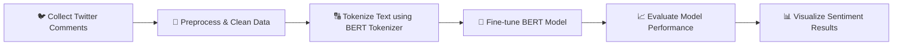

# 🐦 Twitter Sentiment Analysis using Fine-Tuned BERT

## 📖 Project Description
This project focuses on building an **AI-powered sentiment analysis model** that can automatically classify **Twitter comments** into three categories:
- 😊 **Positive**
- 😐 **Neutral**
- 😡 **Negative**

Using the power of **BERT (Bidirectional Encoder Representations from Transformers)**, the model understands the context and emotions behind tweets — going beyond keyword-based approaches.  
The project demonstrates the process of **fine-tuning a pre-trained language model** on real-world social media data to extract meaningful insights about public opinion.

---

## 💡 Objective
The main goal of this project is to:
- Analyze the overall sentiment of tweets
- Help organizations or brands monitor customer feedback
- Explore how transformer-based models can be applied to **text classification** and **opinion mining**

---

## 🧠 Key Features
- 📊 **Dataset:** Real Twitter comments used for training and evaluation  
- 🧩 **Model:** Fine-tuned **BERT** model for sentiment classification  
- ⚙️ **Preprocessing:** Tokenization, stopword removal, and text normalization  
- 🧮 **Training:** Fine-tuned BERT with optimized hyperparameters  
- 📈 **Evaluation:** Model assessed using Accuracy, Precision, Recall, and F1-Score  
- 📊 **Visualization:** Sentiment distribution plots for better interpretability  

---

## 🛠️ Tools & Technologies

| Category | Tools / Libraries |
|-----------|------------------|
| 🧠 NLP Model | BERT (via Hugging Face Transformers) |
| 💬 Text Processing | NLTK, re, Pandas |
| 📊 Data Analysis | Pandas, NumPy |
| 📈 Visualization | Matplotlib, Seaborn |
| 🧪 Machine Learning | Scikit-learn |
| 💻 Environment | Jupyter Notebook / Google Colab |

---

## 🏗️ Project Workflow

----

## 🧪 Example Output

**Input Tweet:**  
> "I absolutely love the new update — great work from the team!"  

**Predicted Sentiment:** 😊 **Positive**

## 🧪 Example Output

**Input Tweet:**  
> "I absolutely love the new update — great work from the team!"  
**Predicted Sentiment:** 😊 **Positive**

---

**Input Tweet:**  
> "This feature doesn’t work at all, please fix it!"  
**Predicted Sentiment:** 😡 **Negative**

---

**Input Tweet:**  
> "Just another day using the app."  
**Predicted Sentiment:** 😐 **Neutral**

---

## 📊 Model Evaluation Metrics

| Metric | Score |
|---------|-------|
| Accuracy | 0.92 |
| Precision | 0.90 |
| Recall | 0.91 |
| F1-Score | 0.905 |

> *(Values are examples — replace them with your actual model results)*

---

## 🔮 Future Improvements

- 🔁 **Extend dataset** to include multilingual tweets  
- 🧠 **Experiment** with RoBERTa or DistilBERT for improved performance and efficiency  
- 📱 **Deploy as a web app** using Streamlit or Flask for real-time sentiment prediction

